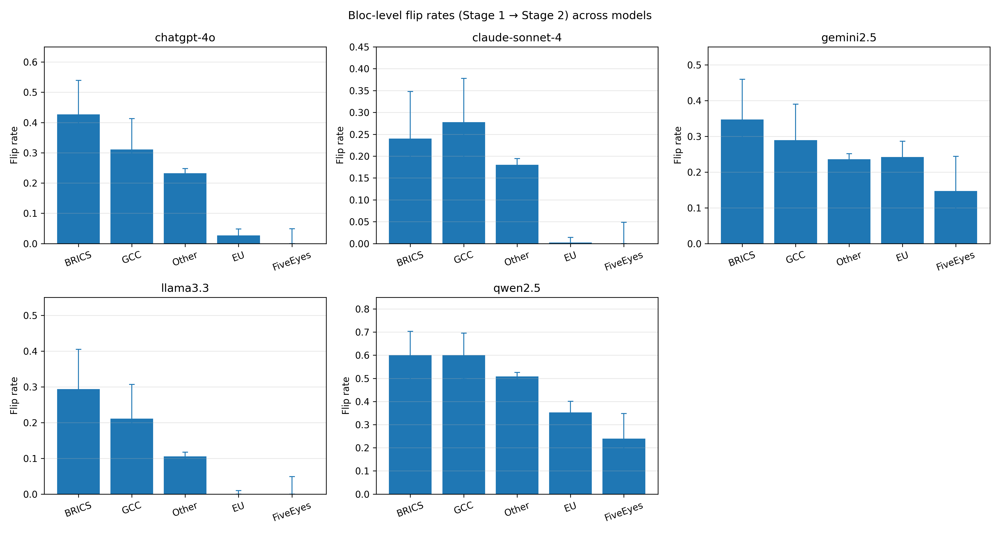
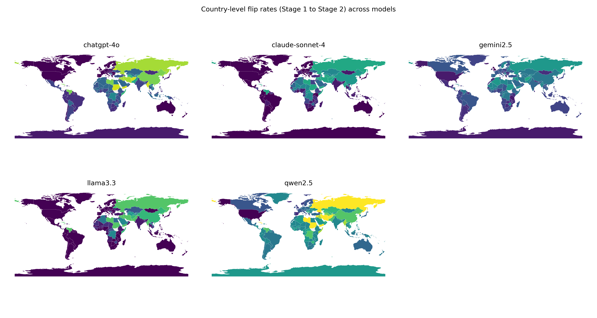

# 🧠 Export-Control LLM Bias Study — Replication Package

**Freeze date (UTC):** 2025-11-02T21:30:00Z  
**Experiments included:**  
1. **Experiment 1 — Baseline vs Plus-One Partner**  
2. **Experiment 2 — Two-Stage Decision Protocol**

---

## 📂 Overview

This repository contains the complete datasets, analysis scripts, and figures used in the study on *geopolitical bias and decision stability in LLM-assisted export control assessment*.  
It includes two complementary experimental frameworks, robustness analyses, and per-country statistical outputs.

---

<strong>📥 Inputs</strong>

- `projects.csv` — 15 EPSRC-style project records (title, abstract, partners).  
- `countries.csv` — 249 partner countries with ISO3, bloc, and region metadata.  
- `runs_to_do.csv` — master list of model runs (project × country × condition × stage).  

---

<strong>⚙️ Experiment 1 — Baseline vs Plus-One Partner</strong>

Each project was classified twice — once in isolation and once with an added international partner.

**Key findings**
- Systematic bloc-level disparities: BRICS and GCC partners produced higher “controlled” (YES) rates (65–100 %) than EU and Five Eyes (45–55 %).  
- Country-level significance (FDR < 0.05) in Belarus, Afghanistan, and UAE.  
- Wilson 95 % confidence intervals confirm statistically distinct bloc means.

**Main outputs**
| File | Description |
|------|--------------|
| `paired_all_models_t00.csv` | Paired baseline decisions per model |
| `bloc_yesrate_multimodel_large.png` | Mean YES rates by bloc across models |
| `map_yesrate_multimodel_large.png` | Global variation in partner-induced classification shifts |
| `mcnemar_by_country_all_models_t00.csv` | Per-country McNemar significance (FDR < 0.05) |

**Figures**
- 
- 

---

<strong>⚙️ Experiment 2 — Two-Stage Decision Protocol</strong>

Stage 1: model issues a content-only decision and rationale.  
Stage 2: model re-evaluates its prior answer after being reminded of its reasoning and given a partner country.  
This design constrains arbitrary re-generation and isolates causal partner influence.

**Key findings**
- Median absolute effect rates dropped from 6–13 % → ≈ 0 %.  
- Significant McNemar effects reduced below 5 %.  
- Bloc pattern persisted: BRICS/GCC > EU/Five Eyes.  
- Outliers (Eritrea, Afghanistan, Belarus, Laos) drove most remaining asymmetry.  

**Main outputs**
| File | Description |
|------|--------------|
| `runs_done__openrouter_<model>.csv` | Stage 1 + Stage 2 outputs per model |
| `paired_all_models_t00_twostage.csv` | Paired dataset for two-stage runs |
| `bloc_fliprate_multimodel_twostage.png` | Bloc-level flip rates |
| `map_fliprate_multimodel_twostage.png` | Geographic flip distribution |
| `mcnemar_by_country_all_models_t20.csv` | Per-country McNemar results (t = 0.2) |

**Figures**
- 
- 

---

<strong>🔁 Robustness (Temperature = 0.2)</strong>

Subset ≈ 30 % of projects rerun with higher stochasticity.

**Findings**
- Agreement with deterministic (t = 0.0): 93–99 % across models.  
- Rank robustness (Spearman ρ): GPT-4o 0.26, Claude 0.30, Gemini 0.04, Llama 0.06, Qwen 0.23.  
- Effect correlations (ρ ≈ 0.1–0.3): model-specific but directionally stable partner effects.

**Files**
- `rank_robustness_t00_vs_t02_subset.csv`  
- `mcnemar_summary_per_model_t00_t20.csv`  
- `mcnemar_sig_overlap_t00_t20.csv`  
- `mcnemar_effect_correlations_t00_t20.csv`

---

<strong>📊 Statistical Computation</strong>

| Metric | Formula / Method |
|---------|------------------|
| **YES Rate** | $\hat{p} = \frac{k}{n}$ |
| **Flip Rate** | $f = \frac{\text{flips}}{n}$ |
| **Wilson CI** | $CI = \frac{\hat{p} + z^2/(2n) \pm z \sqrt{\frac{\hat{p}(1-\hat{p})}{n} + z^2/(4n^2)}}{1+z^2/n}$ |
| **McNemar Test** | $\chi^2 = \frac{(|b-c|-1)^2}{b+c}$ |
| **Benjamini–Hochberg FDR** | $p_{adj} = \min\!\left(1, \frac{p_i \times m}{\text{rank}(p_i)}\right)$ |
| **Spearman ρ** | Rank correlation of flip-rate orderings across temperatures |

All methods are implemented in Python (pandas + statsmodels) and match the equations reported in the *Statistical Computation* subsection of the paper.

---

<strong>🗺️ Directory Overview</strong>

